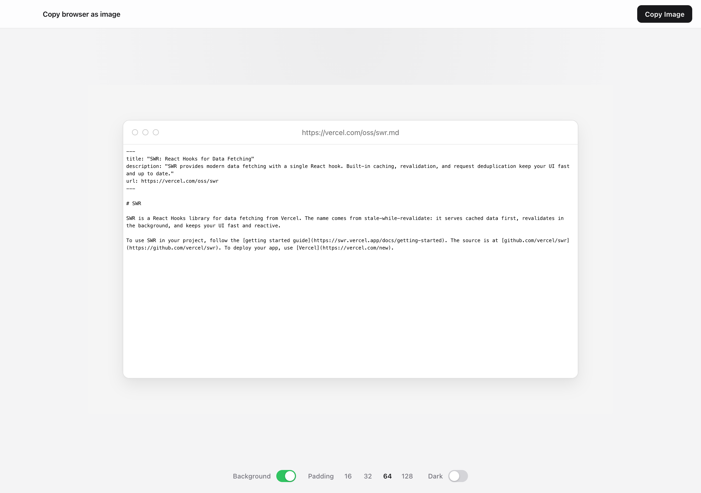
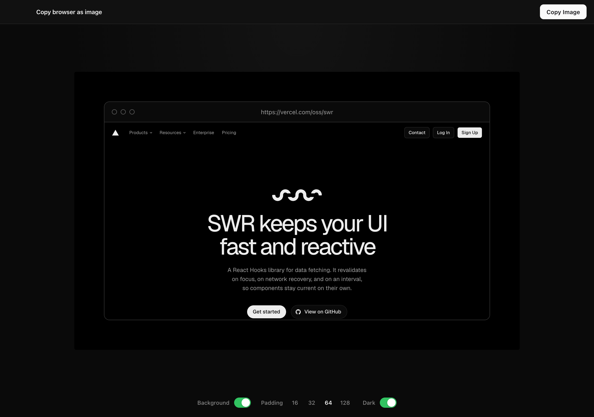

# URL Frame

Minimal browser chrome nested in a ray.so-style frame — for Slack screenshots where the URL matters.

| Light | Dark |
| --- | --- |
|  |  |

## Requirements

- macOS, Windows, or Linux
- [Node.js](https://nodejs.org/) 18+

## Install & run

```bash
git clone https://github.com/sambernhardt/url-frame.git
cd url-frame
npm install
npm start
```

## Use

1. Paste a URL in the top bar, hit Enter
2. Tune theme / padding / background in the bottom toolbar
3. **Copy Image** (`⌘⇧C` / `Ctrl+Shift+C`) — copies just the nested frame (gradient + browser window)

Turn **Background** off to copy a transparent PNG (chroma-keyed alpha) for Slack, Figma, etc.

## Shortcuts

| Shortcut | Action |
| --- | --- |
| `⌘L` / `Ctrl+L` | Focus URL bar |
| `⌘C` / `Ctrl+C` | Copy framed image |
| `⌘⇧C` / `Ctrl+Shift+C` | Copy framed image |
| `⌘R` / `Ctrl+R` | Reload |
| `⌘[` / `⌘]` · `Alt+←` / `Alt+→` | Back / Forward |

## License

MIT
